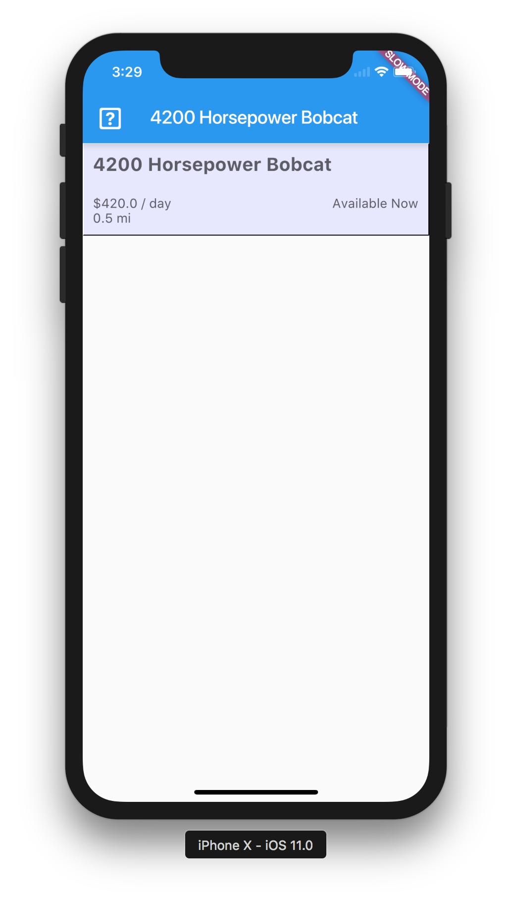

# Building Layout
As a part of [listing-detail header](https://trello.com/c/vaWX0H5j/67-flutter-listing-detail-page) card on trello, I need to build the layout of the listing detail page. However, this has proven to be harder than I originally thought.

Here is a brief guide of how to build layouts and their quirks in flutter

# IMPORTANT! - Master Docs
[see the master layout docs here](https://flutter.io/widgets/layout/)

## ListView
Generates an infinite space which can forever scroll. Don't nest these (or at least avoid doing so) as this will cause an annoying crash detailed here: https://github.com/flutter/flutter/issues/8296#issuecomment-281473052

The basics is that two vertical scrolling boxes not shrink-wrapped would scroll forever inside each other

## Container
A basic container, my current understanding is that it's a `<div>` wrapper for when you want to apply borders and colors to it. It can only have 1 child

## Row
Instance of `flex` where children are cascaded horizontally

## Column
Instance of `flex` where children are cascaded vertically

## Flex
A more generalized container that has `display: flex` put on it. Use like so:

```dart
new Flex(
  direction: Axis.horizontal,
  mainAxisAlignment: MainAxisAlignment.spaceBetween,
  crossAxisAlignment: CrossAxisAlignment.start,
  children: [
    ...
  ]
)
```
Notably, I will have to specify axises and directions

# Finished Header
