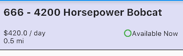

# Style

Obviously, any sensible front-end app will require styles, however, because this is mobile development, we don't have a separate set of CSS sheets, and instead each component has their own styles which are taylored just for that component. Here we go over how to style different components

## Text

Text widgets are mobile's answer stuff like `<p>` or `<span>`. Consider the example:

```dart
Text greenIconText = new Text(
  toString(FontAwesomeIcons.circleO),
  style: new TextStyle(
    color: Colors.green,
    fontStyle: FontStyle.normal,
    fontSize: 18.0, 
    fontFamily: "FontAwesome"
  )
);
```

Putting this into a row element like so:

```dart
new Row(
  children: <Widget>[
    greenIconText,
    new Text('Available Now')
  ],
)
```

achieves the desired outcome here:



## Note
- Remember, your family are specified in your `pubspec.yaml` file
- The default "MaterialIcons" fontFamily must be used for material icons
- If the icons and assets aren't loading correctly, it's likely you need to update your flutter, ios-deploy, and android studios!

### References

- [Flutter docs](https://docs.flutter.io/flutter/widgets/Text-class.html)