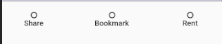

# Buttons

Even in a read-only app, we have to have some way for the user to interact with our system. Buttons provide a natural interface with which user can tap on to affect the app state.

## ButtonBar

Looking for a horizontal row of buttons that look something like this:



then the [ButtonBar class](https://docs.flutter.io/flutter/material/ButtonBar-class.html) is for you.

use it like so:

```dart
new ButtonBar(
  alignment: MainAxisAlignment.spaceBetween,
  children: <Widget>[
    redButton,
    blueButton,
    otherButton
  ]
)
```

## Padding and Expanded
Through judicious use of the [Expanded](https://docs.flutter.io/flutter/widgets/Expanded-class.html) and [Padding](https://docs.flutter.io/flutter/widgets/Padding-class.html), I am able to achieve a row of buttons that expans across the entire mobile device:


```dart
Widget _expandedFlatButton(VoidCallback onPressed, String txt) {
  return new Expanded(
    child: new FlatButton(
      onPressed: onPressed,
      color: Colors.pink,
      child: new Padding(
        padding: new EdgeInsets.symmetric(vertical: 12.0),
        child: new Column(
          children: _iconButtonContent(FontAwesomeIcons.circleO, txt)
        ),
      )
    ),
  );
}
```

## DDAU
One of the core concepts we take away from React and Ember is the concept of data-down-action-up. This philosophy naturally informs how we build user interaction components here in the land of flutter.

Consider how I've structured the horizontal navigation widget:

```dart
class HorNavAPI {
  final VoidCallback sharePressed;
  final VoidCallback bookmarkPressed;
  final VoidCallback rentPressed;

  const HorNavAPI({
    this.sharePressed,
    this.bookmarkPressed,
    this.rentPressed
  }) : super();
}

Widget horNav(HorNavAPI api) {
  return ...
}
```

Notably, users of the `horNav` widget function must provide an instance of the `HorNavAPI` object. Presumably, I could have done the same thing if I extended the `StatefulWidget` class like so:

```dart
class HorNav extends StatelessWidget {
  ...
}
```

Exactly if I want to do it in the "functional" versus "inheritance" way is up to preference

Nevertheless, it's probably best I first familiarize myself with dart flutter convention and use `StatefulWidget` and `State<T>` before trying get creative. See my implementation in the horizontal-nav.dart file