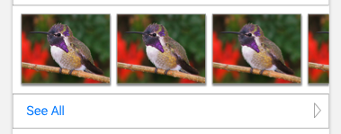
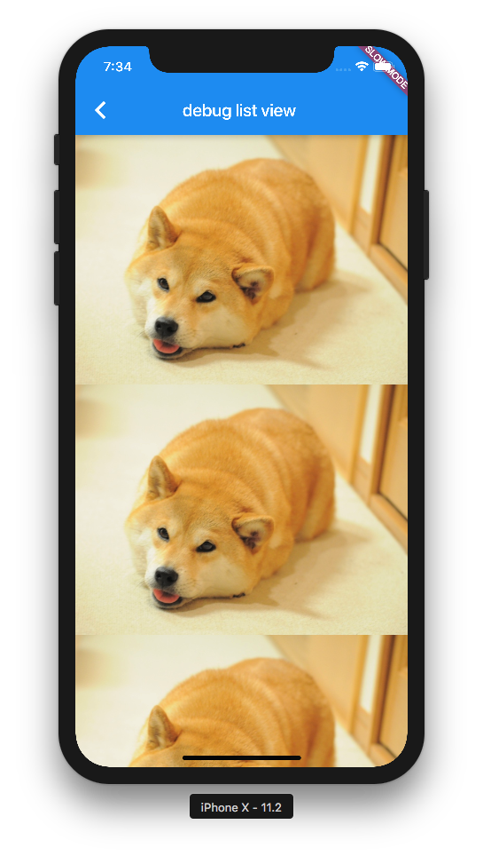
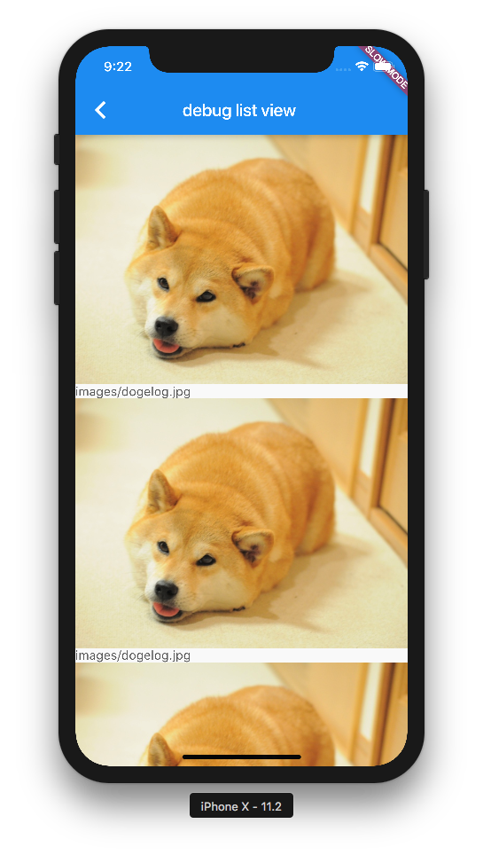
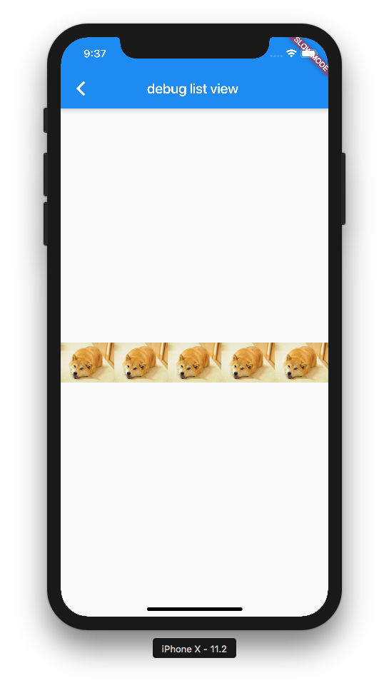
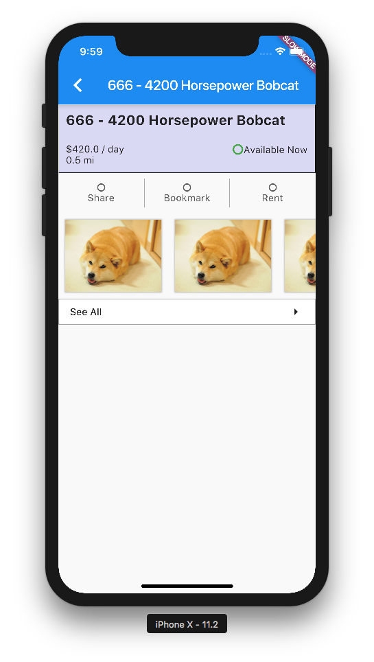

# ListViews

In this branch, I attempt to build a section button that has a picture that is partially cropped. Something like this:



## Starting Out
Having discovered how to start out widget files, we start out our `GalleryPreview` widget in the same `StatefulWidget` way as with our previous one:

```dart
class GalleryPreview extends StatefulWidget {

}

class _GalleryPreviewState extends State<GalleryPreview> {
  
}
```

## Setting Up
As is standard flutter convention, a StatefulWidget requires a constructor and implementation of the `createState` method:

```dart
class GalleryPreview extends StatefulWidget {
  final List<String> imageURIs;

  GalleryPreview({
    Key key,
    this.imageURIs
  }) : super(key: key);

  @override
  _GalleryPreviewState createState() => new _GalleryPreviewState();
}
```

In this case, I elected to use `imageURIs` as a potentially large amount of images, though I as by spec, I will only use 3 of those images

## Parts Composition
I decide to decompose the observed GaleryPreview widget into a Column containing the preview images and then the see all button. The code looks like this:

```dart
class _GalleryPreviewState extends State<GalleryPreview> {
  @override
  Widget build(BuildContext context) {
    return new Column(
      children: <Widget>[
        new _TriplePreview(
          imageURIs: widget.imageURIs,
        ),
        new _SeeAllButton(
          onPressed: widget.seeAllPressed,
        )
      ],
    );
  }
}
```

I will implement the `_TriplePreview` and the `_SeeAllButton` as `StatelessWidgets`

## Stateless Widget
[Review the documentation for stateless here](https://docs.flutter.io/flutter/widgets/StatelessWidget-class.html). An interesting thing I note is that I could have implemented all my previous things with `StatelessWidget`s since none of them had mutable state. Ah well, that's ok, it's all a part of the learning process

In any case, the `_TriplePreview` as a nascent implementation of a `StatelessWidget` looks like this:

```dart
class _TriplePreview extends StatelessWidget {
  final List<String> imageURIs;

  _TriplePreview({
    Key key,
    this.imageURIs
  }) : super(key: key);

  @override
  Widget build(BuildContext context) {
    
  }
}
```

## Conditional Expressions
I want to write a getter to access the first three images of the the `imageURIs` given me, consider my syntax:

```dart
String get firstImageURI => imageURIs[0] ?? _placeholderImageURI;
```

Note that the `get` comes after the type, and there is no `()` after the property name. Furthermore, note that in dart, we use the `??` operator to null check then return the one we want. This is different from JS or ruby where the `||` doubles as both the boolean checker as well as the falsey checker

[Review condition expressions in dart here](https://www.dartlang.org/guides/language/language-tour#conditional-expressions)

## ListView
We want images that can scroll according to user input, so we use the `ListView` component. In our particular case, to accommodate for potentially infinite lists, we use [the ListView.builder](https://docs.flutter.io/flutter/widgets/ListView/ListView.builder.html)

### The Problem of Infinite Size
I ran into the following render error while using ListViews:

```
══╡ EXCEPTION CAUGHT BY RENDERING LIBRARY ╞═════════════════════════════════════════════════════════
Horizontal viewport was given unbounded height.
Viewports expand in the cross axis to fill their container and constrain their children to match
their extent in the cross axis. In this case, a horizontal viewport was given an unlimited amount of
vertical space in which to expand.

When the exception was thrown, this was the stack:

```

This has to do with the different constraints on RenderBoxes; I need to learn more by reading https://flutter.io/layout/ and possibly this comment https://github.com/flutter/flutter/issues/8296#issuecomment-281506821 for clarification

## OverflowBox
Consider the fact that the 4th image in our `PreviewGallery` widget overflows the parent. To achieve, this effect, I must employ [the OverflowBox widget](https://docs.flutter.io/flutter/widgets/OverflowBox-class.html)

## ListView Experiments
I admitedly don't know how to use `ListView`s, so here is a series of exercises in the `debug/list-view` route for me to practice using ListView

### Vanilla
Vertical ListView in a scaffold:

```dart
new Scaffold(
  body: new ListView(
    children: <Widget>[
      new Image.asset('doge.jpg'),
      new Image.asset('doge.jpg'),
      new Image.asset('doge.jpg'),
      new Image.asset('doge.jpg')
    ]
  )
)
```

This renders correctly:

;

### Builder
The builder is a way of specifying potentially infinite list view elements:

```dart
return new ListView.builder(
  itemCount: 3,
  itemBuilder: (BuildContext context, int index) { 
    return new Image.asset(
      'images/dogelog.jpg'
    );
  },
);
```

The result is same as above

### Mixed types:

```dart
Widget _mixedLazyList() {
  return new ListView.builder(
    itemCount: 10,
    itemBuilder: (BuildContext context, int index) { 
      if (index % 2 == 0) {
        return new Image.asset('images/dogelog.jpg');
      } else {
        return new Text('images/dogelog.jpg');
      }
    },
  );
}
```

We get exact as we expect



### Contained Lists

Next, we'll try creating a `ListView` that's wholly contained inside an element

```dart
body: new Container(
  height: 150,
  child: _lazyDogeList()
)
```
It seems if we have a vertically scrolling `ListView`, it all works as long as we have the vertical dimension properly confined.


### Horizontal Lists

Next, let's try to create a horizontal list. Naively, I just plug it into 

```dart
Widget build(BuildContext context) {
  return new Scaffold(
    appBar: new AppBar(
      title: new Text(title),
    ),
    body: _lazyDogeListH()
  );
}

Widget _lazyDogeListH() {
  return new ListView.builder(
    scrollDirection: Axis.horizontal,
    itemCount: 10,
    itemBuilder: _itemBuilder,
  );
}
```

This works admirably, and we get a horizontal list:



### Actual Usage

Putting it all together, we can achieve the desired affect:



by constraining the height of the container that holds the list view in the gallery-preview.dart file:

```dart
new Container(
  height: 125,
  child: new ListView(
    scrollDirection: Axis.horizontal,
    buildItem: _buildItem
  )
)
```
## Quirks
Some patterns and quirks I notice while playing with the ListView

### `scrollDirection` direction affects how `Image.asset` must have its dimension specified.

If `Axis.vertical` we must constrain `Image.asset(width: 12.0)` to have an affect on the image size

If `Axis.horizontal`, we must constrain the `height: XXX` to have an affect on the image.

Logically I think this is because `scrollDirection` tells us which axis has infinite length, and thus if we specify an length on a child element that lives in a container of infinite length, the math doesn't actually constrain how "big" the Widget should appear on the screen.

Alternatively, if we constrain the perpendicular axis, it's possible to calculate the expected image size based upon image scale.