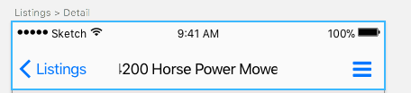

# AppBar

Here, we try to customize the AppBar header to resemble our specs:



Sensible api and guides for the [app bar can be found here](https://docs.flutter.io/flutter/material/AppBar-class.html)

## Actions

Apparently, it's extremely easy to add additional action buttons to the AppBar widget

```dart
new AppBar(
  title: new Text(widget.title),
  actions: <Widget>[
    new IconButton(
      icon: new Icon(Icons.menu),
      tooltip: 'Side menu',
      onPressed: () {},
    )
  ],
),
```

does it (lol!)