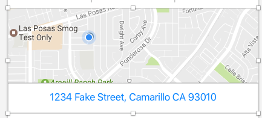
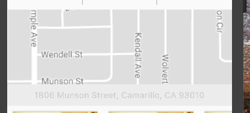

# Static Map Buttons

Here, I'm trying to implement a button that has a map and address that looks like:



## Static Map Source

Registering for a Google maps account (details in this ticket https://www.pivotaltracker.com/story/show/153801928), I am able to generate the proper URL using the following `staticMapURI` function:

```dart
String staticMapURI({
  String address,
  MapType maptype: MapType.roadmap,
  int width: 640,
  int height: 480,
  int zoom: 13
}) {
  final Uri uri = new Uri.https('maps.googleapis.com', 'maps/api/staticmap', {
    'center': address,
    'size': '${width}x$height',
    'maptype': _mapTypeStr(maptype),
    'key': _googleStaticMapAPIKey,
    'zoom': zoom.toString()
  });
  return uri.toString();
}
```

# Widget

The widget can be built easily with a `Column` and two members:

```dart
new Column(
  children: <Widget>[
    new _MapContainer(),
    new _AddressButton()
  ]
)
```

## Achieving Alignment

By default, `Column`s use `CrossAxisAlignment.center`, however in order to achieve the desired cross axis alignment, we must `.stretch`:



## Bordered Buttons

Recall from implementing the `gallery-preview` that a border button can be achieve by placing a raised button inside a container with the proper decorations:

```dart
new Container(
  decoration: new BoxDecoration(
    border: new Border.all(
      color: Colors.black45
    )
  ),
  child: _buildButton()
);
```

We thus arrive at this:


