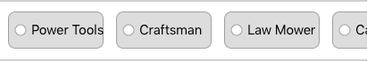

# Data Tag

Here, I attempt to implement the row of tag elements that we see here:



## Data Pattern

Presumably, tags are not just mere strings and should instead be represented as some sort of a data model object. I do this by specifying the `data/tag.dart` file:

```dart
class Tag {
  final String displayName;

  Tag({
    this.displayName
  });
}
```

## fmap

The API I've built around the `TagsGallery` consumes a `List<Tag>` element like so:

```dart
new TagsGallery(
  onPressed: doNothing,
  tags: <Tag>[
    new Tag(displayName: 'doge'),
    new Tag(displayName: 'corgi'),
    new Tag(displayName: 'husky'),
    new Tag(displayName: 'malamute'),
    new Tag(displayName: 'burmease'),
    new Tag(displayName: 'wolf'),
    new Tag(displayName: 'purse dog')
  ]
)
```

But in the implementation, I spawn all the `tag`s with a `.map` call. However, note that `map` returns an `iterable<T>` which is not necessarily a `List<T>`, as such, I must call `.toList()` on the iteratble like so:

```dart
children: tags.map((Tag tag) => 
  new _TagButton(
    tag: tag, 
    onPressed: onPressed
  )
).toList(),
```

The end result is here:


Note that I've chosen to not exactly follow the given spec based upon inspiration from YELP's tag system, and the fact the specs weren't that good in the first place.

In this case, I should create a story to update the specs to match the actual implementation for posterity sake.