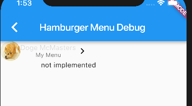
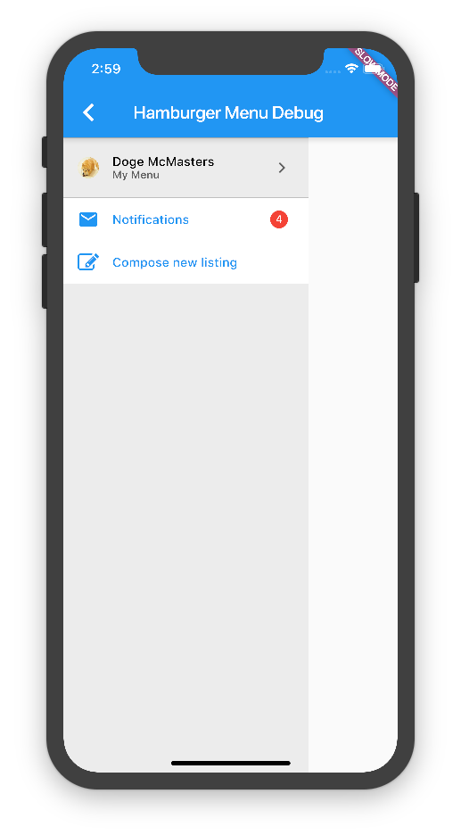

# Hamburger Menu

Here, we attempt to build and style a hamburger menu that will slide onto the screen. The menu looks like:


Although the design and the actual spec layout of the menu will be most likely reasonably easy, the tricky part would be deploying this object as I currently don't know how to deploy side activities and fragments in a sensible way.

For now, I will develop the menu in the `debug/hamburger` route and then worry about actually deploying it later on.

## Rapid Scaffold

Rapidly scaffolding the structure of the hamburger menu, I currently arrive at the following idea for layout:

```haml
.hamburger
  .hamburger-header
  .hamburger-section
    .hamburger-link 1
    .hamburger-link 2
  .hamburger-section
    .hamburger-link 3
    .hamburger-link 4
```

Rapidly implementing without the entire style, I quickly arrive at:



### Problems

Unfortunately, this doesn't quite match spec yet, and here are the problems I'm currently seeing:

- Hamburger menus should cover the height of the entire screen, currently, I don't know how to do this. I would need to review the section on BoxContraints in hopes of finding a way to draw a full-screen thing https://docs.flutter.io/flutter/rendering/BoxConstraints-class.html
- The hamburger menu should have a dark overlay background which obscures a portion of the screen
- The color and alignnment for the text are currently wrong

## Alternate Constructors

Using a different series of constructor strategies such as:

```dart
class _HamburgerNotification extends StatelessWidget {
  final NotificationSeverity severity;
  final String message;
  final Color backColor;
  final Color textColor;

  _HamburgerNotification.danger({
    Key key,
    this.message: ''
  }) 
  : backColor = Colors.red,
    textColor = Colors.white,
    severity = NotificationSeverity.danger,
    super(key: key);

  _HamburgerNotification.warning({
```

I am able to provide a sensible API to generating different notifications.

As such, the styling is complete as we reach the desired outcome:



However, we are currently still missing the other icons; I will fill those in slightly later.

### Note

Due to using `FlatButton` which inherits from `MaterialButton`, which in turns has styles already affixed, my end-spec is slightly different from what was originally spec'd out.

I should make a mental note to one day learn how to properly style out buttons straight from inkwells and whatnot so that I can get better control over the input systems available on mobile

## ImageProvider

Apparently, all of `Image.asset`, `Image.network`, etc., are all wrappers over the `ImageProvider<T>` API which represents different ways for an image to be delivered onto the mobile platform.

This different in asset delivery strategy is different from the `` of the world of html, and better encapusulates capturing images. Consider how I deliver images via a getter in `data/user.dart`

```dart
import 'package:flutter/material.dart';

class User {
  final String avatarImageURL;
  final String fullName;

  User({
    this.avatarImageURL,
    this.fullName
  });

  ImageProvider<dynamic> get imageProvider => avatarImageURL != null ? new NetworkImage(avatarImageURL) : new AssetImage('images/dogelog.jpg');
}
```

## Notifications

One thing I'll still need to do is create a `Notification` data object which can encapsulate what menu bars need what sort of notification in the hamburger menu. Right now, all this is hard-coded and thus does not provide a sensible API for consumers of the hamburger menu to properly customize.

 # Maybe v. Control Flow

 Currently, if no `notification`s are present in the hamburger menu, we don't show the red button at all. The logic for doing this is done with a `if` statement like so:

 ```dart
 Widget _buildNotificationLink() {
  if (notifications > 0) {
    return new HamburgerMenuLink(
      icon: Icons.email,
      linkName: 'Notifications',
      notification: hamburgerMenuNotification,
      onPressed: () {
        return onPressed('Notifications');
      },
    );
  } else {
    return new HamburgerMenuLink(
      icon: Icons.email,
      linkName: 'Notifications',
      onPressed: () {
        return onPressed('Notifications');
      },
    );
  }
}
```

This is the imperative way of handling conditionals and is implicitly not type-safe as the `notification` member passed to `HamburgerMenuLink` can be `null`, which introduces run-time bugs instead of compile-time ones.

What I instead should do is use a `Maybe` framework. Checkout the documentation in the `maybe.dart` file