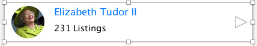
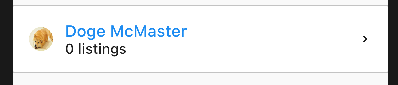

# User Blurb

Here, we attempt to build the following `Widget` asset:



There isn't much that's tricky in building this `Widget`, the standard usage of `FlatButton`, `Row`, `Column`, and `Container` achieves this admirably.

## Refactoring from Header

One thing to note is that we have refactored the `RoundImage` asset into its own `Widget` in `images/round.dart` like so:

```dart
class RoundImage extends StatelessWidget {
  final double radius;
  final EdgeInsets margin;
  final ImageProvider<dynamic> imageProvider;

  double get width => radius * 2;
  double get height => width;

  const RoundImage({
    Key key,
    this.radius: 12.0,
    this.margin,
    @required this.imageProvider
  }) : super(key: key);

  @override
  Widget build(BuildContext context) {
    return new Container(
      width: width,
      height: height,
      margin: margin,
      decoration: new BoxDecoration(
        borderRadius: new BorderRadius.circular(radius),
        image: new DecorationImage(
          image: imageProvider,
          fit: BoxFit.fill
        )
      ),
    );
  }
}
```

I imagine I would wind up doing more of this through the app to share common widgets

## Shared Styles

In line with the the sharing of `Widget`s via the `images/round.dart`, we are now also sharing styles in the `utils/styles.dart` file:

```dart
abstract class BorderStyles {
  static const divider = const BorderSide(color: Colors.black38);
  static const sandwich = const Border(
    top: divider,
    bottom: divider
  );
}
```

Here, I use `BorderStyles` as a name space, although it's entirely feasible that I would later use `import` statements to structure namepsaces as dart originally intends.

## Annotations

One thing I should note is that I'm importing `import 'package:meta/meta.dart';` at the top of the `images/round.dart` file. What this statement does is enable access to the the annotations of `@required` and others that we see throughout the `flutter` codebase.

Annotations in dart serve no purpose but to provide metadata for the compiler. [Checkout this stackoverflow page for an explanation](https://stackoverflow.com/questions/19492607/how-to-retrieve-metadata-in-dartlang). This stuff enables the so-called reflection stuff that makes for good programmer experience, though it doesn't have any impact upon the output code. Checkout the article [here](https://www.dartlang.org/articles/dart-vm/reflection-with-mirrors).

Consider the statement:

```dart
class Dog {
  Dog({
    @required this.name
  });
}
```

what `@required` does is initialize an instance of `Required` and attaches it to the metadata of the `this.name` on the `Dog` class. Really spiffy stuff, but note that it's different from typical javascript decorators which actually apply transforms and such instead of merely attaching data

## Const Constructors

This chapter is turning into a big lesson dart (lol). As per instructions on the [constant constructors on the dart site](https://www.dartlang.org/guides/language/language-tour#constant-constructors), it seems if I ever make classes where all the member have immutable data, I get to declare their constructors as `const`.

For example, consider my `data/user.dart` class:

```dart
class User {
  final String name;

  const User({
    @required this.name
  });
}
```

In this case, since `name` is `final`, and no reassignments can occur, I should declare the constructor `const`. This is probably good practice which means from now on and throughout the rest of my programming in `dart`, I will strive to only create `const` constructors

# End Result
Anyway, this was widget was reasonably easy to mark-up:

