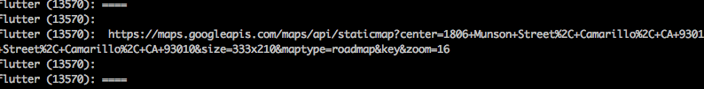
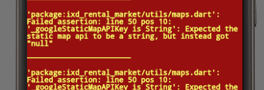

# Dart Language Debug and Assertions

While in the process of trying to implement my static [map marker story](https://www.pivotaltracker.com/story/show/153930050), I encountered a flutter update which broke everything (lol).

In order to fix everything, I will cover some of the problems I encountered and how I resolved them:

## CharCode range exceeded

In my `utils/icons.dart` file, I originally had:

```dart
String toString(IconData icon) {
  return new String.fromCharCode(icon.hashCode);
}
```

However, this resulted in a `CharCode` that was outside the accepabled range. This had to do with a flutter update, and after playing around with the autocomplete in my IDE, I discovered the following fix:

```dart
String toString(IconData icon) {
  return new String.fromCharCode(icon.codePoint);
}
```

## DebugPrint

Flutter ships with a [good documentation on debugging](https://flutter.io/debugging/#debug-mode-assertions), however, the biggest takeway is the following:

- all widgets ship with the `debugPrint` method which can be used like so:

```dart
debugPrint('whatever', { width: 2});
```

Which will cause the console to print out whatever it is I might be interested in; in my particular case, I was trying to get maps to load correctly:



## Dart Core Print
- dart.core ships with `print` commands

If we're outside the realm of apps, we can print to console by importing the dart core then printing:

```dart
import 'dart:core';

print('whatever')
```

## Assertions

Similarly from the dart:core, we have the [`assert` keyword ](https://www.dartlang.org/guides/language/language-tour#default-value). This is probably a macro that is ripped out during compile time, but can be used to catch run time errors. Also, see the [language tour on assert](https://www.dartlang.org/guides/language/language-tour#assert)

In my case, I'm interested in making sure dart is loading my environment variables correctly in the `utils/map.dart` file:

```dart
String staticMapURI({
  ...
}) {
  assert(_googleStaticMapAPIKey is String, 
    'Expected the static map api to be a string, but instead got "$_googleStaticMapAPIKey"');
  ...
}
```

One important to notice is that, while _googleStaticMapAPIKey is an environment level variable, I apparently can't invoke functions outside the context of the `main()` function, which means `assert` can only be called within another function or method. Just be aware of this as this essentially means, in dart, there is no concept of "interpreted" time as there is in JavaScript. 

In anycase, a failing assertion is caught right away like so:



## Environment Variables

Apparently, with the recent update to the flutter (or perhaps it's always been like this), I can no longer access my environment variables. Formerly, I access environment variables like so:

```dart
import 'dart:io' show Platform;
Platform.environment['GOOGLE_STATIC_MAP_API_KEY'];
```

Incidentally, an alternative I found is to use the `String.fromEnvironment` constructor like so:

```dart
final String _googleStaticMapAPIKey = const String.fromEnvironment('GOOGLE_STATIC_MAP_API_KEY');
```

However, in any case, it seems it's not possible to read my `zsh` environment from within flutter. This is a big deal as now I would have to change strategy regarding on I load secret keys. I resolve this by creating a `lib/config/screts.dart` file which I exclude from version control. This now works to include the api key. However, for some reason, it seems I'm still unable to load the image.

Apparently, there is an issue where if flutter updates, I need to kill my simulator and relaunch in order to get everything to work again. In anycase, after much struggle and launching with iOS's iPhoneX, I am finally able to get everything working again:

