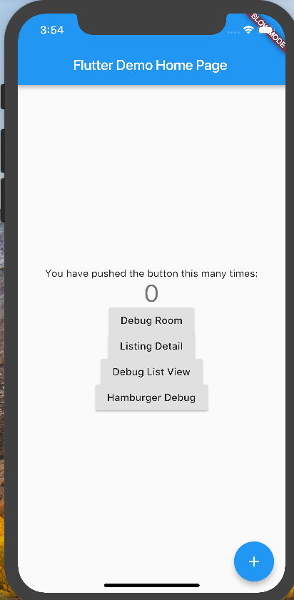
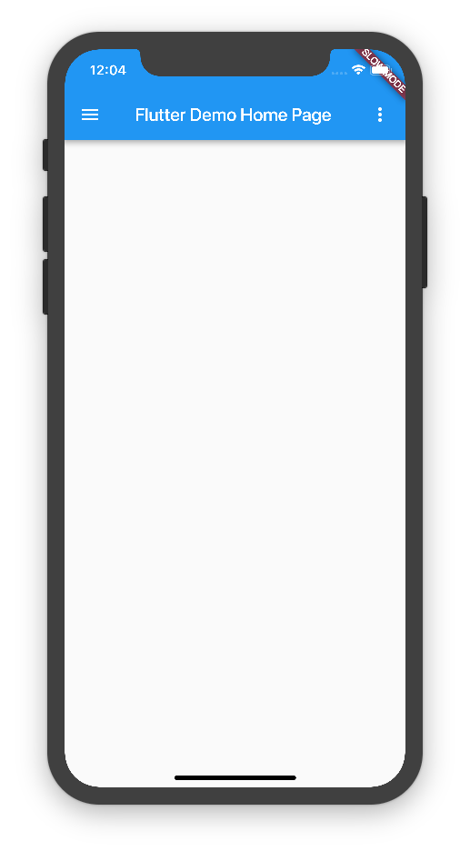

# Background

Until recently, I did not have a home page design, and as such, I was able to default my home page to my debug page:



However, with the design of my home page:



I am now ready to follow the usual convention of relegating my debug route to its own debug page.

## Project Structure

In dart (as was in ruby, elixir, and other more "systems" languages), external libraries always had the structure of exporting one API. Now in this project, I will seek to go back to follow that convention.

Whereas previously, my routes would refer deeply into my widget library classes, I will now properly encapsulate. My current project thus has the following folder structures

- data
- routes
- widgets
- fixtures

All of these separated branchs of the greater project tree then interface with each other via their exposed API in the form of:

- data.dart
- routes.dart
- widgets.dart
- fixtures.dart

This way, we can replace:

```dart
import 'ixd_rental_market:widgets/hamburger-menu/notification-link.dart';
```

with:

```dart
import 'ixd_rental_market:widgets.dart'
```

In turn, the `widgets.dart` file will mostly consist of export statements like:

```dart
export './widgets/hamburger-menu.dart';
```

>Protip: flutter's material app itself is structured like this!

Doing this will allow us to be more organized.

## Library and Part

Bear in mind dart doesn't have namespaces as a concept, and instead has the `library`, `part` and `part of` keywords. This [stackoverflow answer](https://stackoverflow.com/questions/13876879/how-do-you-namespace-a-dart-class) explains this structure.

The TL;DR is that creators of `library`s must handle all dependency imports at the declaration of the library:

`data.dart`:

```dart
library data;
import 'package:meta/meta.dart';
import 'package:flutter/material.dart';

part './data/notification.dart';
part './data/review-aggregate.dart';
part './data/tag.dart';
part './data/user.dart';
```

Then in, declare the sustance of the library as `part of` the given library:

`data/notification.dart`:

```dart
part of data;

enum NotificationSeverity {
  danger,
  warning,
  success,
  info,
  invisible
}

class Notification {
  final String message;
  final NotificationSeverity severity;

  Notification({
    this.message: ' ',
    this.severity: NotificationSeverity.danger
  });
}
```

We propagate this change through out the entire app