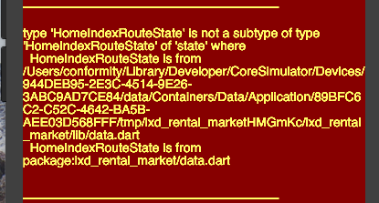

# Redux Integration

Here, I roll in the redux and flutter_redux frameworks in order to achieve proper modern web standard compliant data integration with facebok's redux framework

* flutter redux https://github.com/brianegan/flutter_redux
* redux https://pub.dartlang.org/packages/redux

## AppState

Firstly, I split up data in to `models` and `states` although realistically there is no hard difference. Consider the example of `hamburger.dart`

```dart
part of data;

@immutable
class HamburgerModel {
  final User user;
  final int notifications;

  const HamburgerModel({
    this.user: User.initial,
    this.notifications: 0
  });

  static const initial = const HamburgerModel();
}
```

We declare this to be immutable as every member is immutable, and we then initializes an `initial` state which can be easily used to provide initial states for the redux store.

All of the states compose together in a tree format into a greater `AppState`, which we then use to build the ultimate store object in `routes.dart`

```dart
class AppRouter {
  final Router router = new Router();
  final Store<AppState> store = new Store(appReducer, initialState: AppState.initial);
  ...
}
```

## Flutter Redux
So what does flutter redux get us? Some `Widget`s, of course!

* `StoreProvider` - Use to put a redux store reference to all ancestors of a tree node
* `StoreConnect` - Used to pull data out of redux via convertor and then build a widget via the builder

Consider how we use them in the home (or `'/'`) route:

```dart
router.define(
  '/',
  handler: new Handler(
    type: HandlerType.route,
    handlerFunc: (BuildContext context, Map<String, dynamic> params) {
      return new StoreProvider(
        store: store,
        child: new StoreConnector(
          converter: (Store<AppState> store) => store.state.routesState.homeIndex,
          builder: (BuildContext context, HomeIndexRouteState state) => new HomeIndexRoute(state: state),
        )
      );
    }
  )
);
```

## InheritedWidget

`InheritedWidget`s are an abstract widget class for propagating information down trees. In some way, they represent another take on `Ember.Service` and the dependency injection paradigm.

In Flutter, every build method gets a `BuildContext context` variable which stores contextual information. `InheritedWidget`s represent a way for the developer to put and retrieve information from the `context` object. Consider the usage in `StoreProvider` from the `flutter_redux` package:

```dart
class StoreProvider<S> extends InheritedWidget {
  final Store<S> store;

  const StoreProvider({
    Key key,
    @required this.store,
    @required Widget child,
  })
      : assert(store != null),
        assert(child != null),
        super(key: key, child: child);

  factory StoreProvider.of(BuildContext context) =>
      context.inheritFromWidgetOfExactType(StoreProvider);

  @override
  bool updateShouldNotify(StoreProvider old) => store != old.store;
}
```

Later, the `store` is retreived out in the `StoreConnector` object:

```dart
class StoreConnector<S, ViewModel> extends StatelessWidget {
  ...
  @override
  Widget build(BuildContext context) {
    return new _StoreStreamListener<S, ViewModel>(
      store: new StoreProvider.of(context).store,
      builder: builder,
      converter: converter,
      distinct: distinct,
      onInit: onInit,
      onDispose: onDispose,
      rebuildOnChange: rebuildOnChange,
      ignoreChange: ignoreChange,
    );
  }
}
```

Notice how, using `Widget`s, the flutter api has managed to provide a way for external component libraries to provide dependency / service injections via the `BuildContext context` object given to builds! In Ember, we would've had to place the `StoreProvider` as a service, and then in subsequent `StoreConnector` components, had to inject that service via `store: service('store-provider')` which, necessarily puts the Store at the global level instead of having its place in the tree.

Fun fact, in addition to the flutter redux store, `Navigator`, `Theme`, and possibly other "global services" are all implemented as `InheritedWidget`s

## Type Problem



You run into this problem when you cross import the same libraries as in: https://github.com/dart-lang/sdk/issues/14353

Apparently, twice importing the same libraries results in bad issues, so I will try experimenting with moving my libraries around all into routes in order to fix.

Notably, `dart` sees a difference between:

`import './data.dart'` and import `import 'package:data/data.dart` so be aware of this!

## Factory Constructors

Factory generators represent a declarative way for the end users to make singleton classes. Our `AppRouter` is, in fact, a singleton! Use this pattern if and only if you **know** state will enver change on your class!
```dart
factory AppRouter() { 
  if (_instance != null) {
    return _instance;
  }
  _instance = new AppRouter._();
  return _instance;
}

AppRouter._() {
  _instance.draw();
}
```