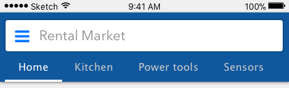
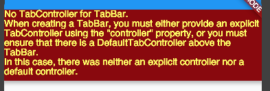
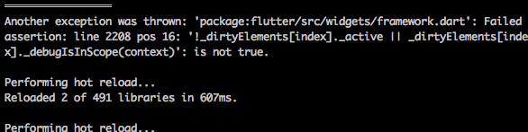
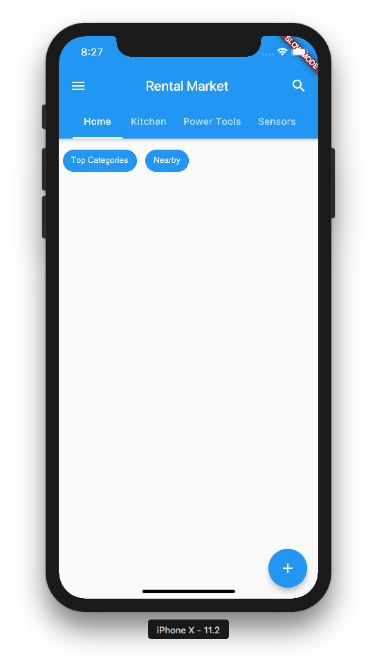

# TabBar and Controllers

In this, I attempt to implement the app bar [tab bar](https://docs.flutter.io/flutter/material/TabBar-class.html):



This should be easy to implement, but apparently `TabBar` must be a child of an ancestor that has a tab controller:



## TabBar Usage

Following in the [tab-bar example here](https://flutter.io/catalog/samples/tabbed-app-bar/), it seems that the material tab bar is very opininated. Specifically, in order for the tabs to manage themselves, specifically, they require a overhead manager to manage the transition between tabs:

```dart
new DefaultTabController(
  length: length
  child: _restOfPages()
)
```

Notice that the `DefaultTabController` is a `StatelessWidget` which wraps around a `TabController` (the `TabBar` then inherits from it). In `_restOfPages()` it is up to the programmer to write the code for **all** the other pages that will be controlled by the `TabBar` using the `TabBarView` widget like so:

```dart
body: new TabBarView(
  children: <Widget>[
    new ListView(
      children: <Widget>[
        _connectChipRow()
      ],
    ),
    new Container(),
    new Container(),
    new Container()
  ],
```

Notice the empty `new Container()`s, I must do this because `TabBar` key off of the index of the children of the `TabBarView`, thus the TabBarView must have *exactly* as many children as we have tabs or else we risk the out of bounds index error:



Next, we connect this with the `flutter_redux` store, making sure to specify that `rebuildOnChange: false` since we don't expect our tabs to be changing on us midway through. We then get:

