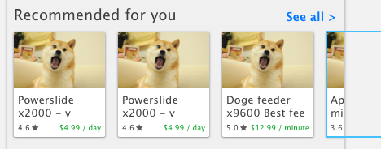
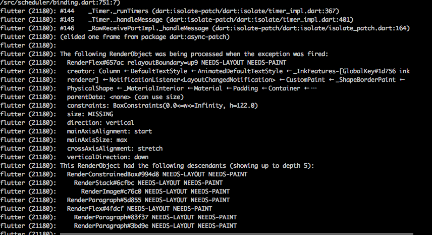
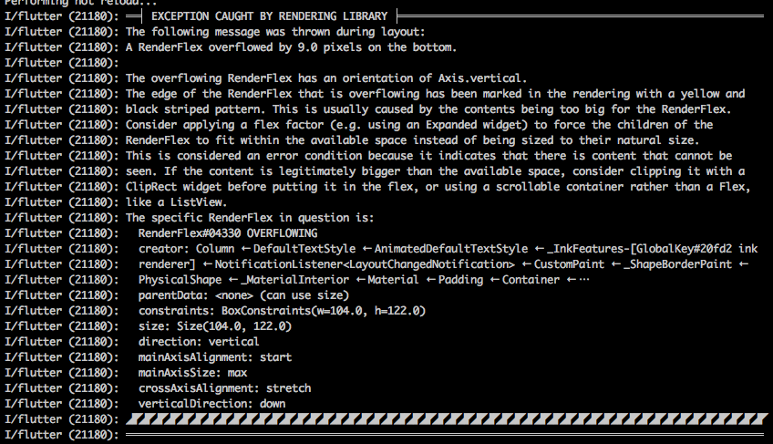

# Material Cards

Here, I attempt to implement the material card row as show here:



## PreferredSize

As a parrt of casual code cleanup from the redux story, one of the issues I ran into is using a `StoreProvider` to wrap around a `PreferredSizeWidget` like `TabBar`. Notably, because `StoreConnector` isn't a `PreferredSizeWidget`, I wound up having to wrap it like so:

```dart
bottom: new PreferredSize(
  preferredSize: const Size.fromHeight(_preferredTabBarHeight),
  child: new StoreConnector(
    converter: (Store<AppState> store) =>
      store.state.routesState.homeIndex.categories,
    builder: (BuildContext context, List<TagModel> categories) =>
      new TabBar(
        isScrollable: true,
        tabs: categories.map((tag) => new Tab(text: tag.displayName)).toList(),
      )
  ),
),
```

Notice the `preferredSize: const Size.fromHeight(_preferredTabBarHeight),` line where I break encapsulation and had to inspect the source code of `TabNav` to get the default preferred size of the `TabBar` when it has a child.

>Question: is there a better way to do this?

## Position

Consider the [example card](https://github.com/flutter/flutter/blob/master/examples/flutter_gallery/lib/demo/material/cards_demo.dart#L85) they seem to use some sort of `Position` widget to place things inside a `Column`

## Size Errors

Currently running into the following error:



And it's caused by my `Card` code:

```dart
return new Card(
  child: new Column(
    crossAxisAlignment: CrossAxisAlignment.stretch,
    children: <Widget>[
      new SizedBox(
        height: 130.0,
        width: 112.0,
        child: new Stack(
          children: <Widget>[
            new Positioned.fill(
              child: new Image.asset(
                image,
                fit: BoxFit.cover,
              ),
            )
          ],
        )
      ),
      new Text(
        title,
        style: const TextStyle(
          fontSize: 13.0
        ),
      ),
      new Row(
        children: <Widget>[
          new Text(
            '4.6'
          ),
          new Text(
            '\$12.99 / day'
          )
        ],
      )
    ],
  )
);
```

The solution is that `Card` must be sized in a parent like so:

```dart
Widget build(BuildContext context) {
  return new SizedBox(
    height: 130.0,
    width: 112.0,
    child: new Card(
      child: _buildCardContent(),
    )
  );
}
```

## Overflow Cropping

For titles that are too long, I need some way of croppping text like css's `overflow-x: hidden` (see following error):



which is visible on the page as:


<del>
From the [flutter layout widget guide](https://flutter.io/widgets/layout/) I have that I would likely use the following two Widgets

- [overflow box](https://docs.flutter.io/flutter/rendering/RenderConstrainedOverflowBox-class.html)
- [render clip rect](https://docs.flutter.io/flutter/rendering/RenderClipRect-class.html)

</del>

Apparently, the trick is to merely use the `overflow: TextOverflow.clip` property on the `Text` object. Easy!

With that, we are done!

