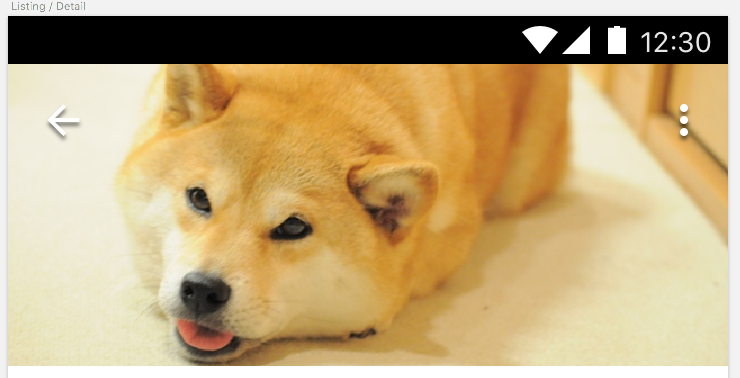
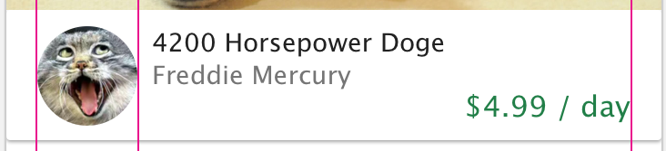

# Product Detail Page Design

At the bare minimum, all modern web apps present information using the following general pattern

- home (aka curated product index)
- product details
- my account (aka settings)

In this journal entry, I analyze some the product detail pages of some of the more popular and well-established apps out there in the industry and hopefully take inspiration from them in the redesign of my own product detail page.

## Starting Point

Currently, the design for my product detail page looks like the following:

Notice the weakness in my current design

- adherent to neither standardized material nor cupertino
- there is no "page action"
- kind of a hodge-podge of yelp mixed with material mixed with cupertino

Next, let's consider some of the reference apps. Note that in both cases, these apps all approach the detail page with a sort of an [card-centric design](https://material.io/guidelines/components/cards.html#cards-actions)

## Android PlayStore

Consider the playstore's detail page (for the OfferUp app):

Some points to note:

- BackButton and Search are invisibly over the hero art
- Header presents clearly the actionable items
- Content and badges come below that
- Gallery images are at the bottom (not shown)

## Contacts App

Next, let's consider the Contacts app that ships with android:

Some points to note:

- There is a strip of labeled icon actions in the header
- There is a floating action button
- Big hero image

## iOS App Store

Now, compare against the ios app store:

Particularly Noteworthy

- If there is no page "main action" it seems both android and ios simply just doesn't include the main action button
- Like android, iOS has the back button at the top left (it's labelled)

## iOS contacts page

Very similar to the android material page, the ios contacts page is rendered here:

Noteworthy

- The primary difference between this and android is that the "main page action" is at the top right

## TODOs

Here are some todos for me to fix on my detail page

- hero header should have a big image
- back button needs to be present in top left
- "main action button" to rent should be available
- tab bar buttons should be icon tabs
- tagline description should come above image gallery
- additional details should go below
- product name and owner should go into the header
- review summary should go into the header area

## Hero Header

The hero header is a combination of an hero image with an app bar. 

Presumably, the benefits of this is that we can combine a very visually appealing header (i.e. hero image) with the standard header functionality.

>Note: the app bar icons are all given shadows so that they contrast properly against the image background

## Page Title

In line with summarizing the most important details up-front, I have all the important information in the page-title section

