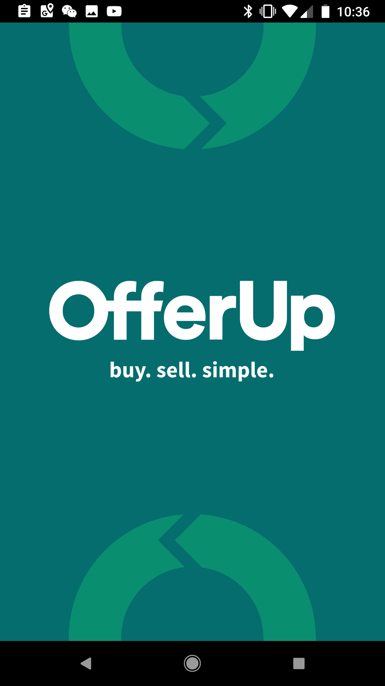

# OfferUp New Listing Flow

Offer-up is the popular service where users use their phones to buy and sell local furniture. Think of it like airbnb for furniture and stuff. Since I'm just building an unapologetic clone of offer-up, it makes sense for me to study its work flow.

## First Time Guide

Offer-up provides an extremely helpful how-to overlay for first time users:

Notice the following positives

- The overlay shows up for first time users
- it is extremely helpful for first-timers since the camera icon is not intuitive as the go-to for taking a picture

However, there are some negatives

- You have the dismiss the overlay by clicking "I got it"
- I should be able to just press the camera icon through the overlay (this is probably an engineering improvement)

## Post Offer

After clicking the camera, we are taken to the new-offer overview page

The design of the page presents some noticeables

- Progress is visible on the bottom
  - this bar is bigger and more illustrative
  - personally, I think this is better than airbnb's since I, as the user, get a better feeling of how much work is involved and will therefore be less surprised

- There are two secondary (ghost) buttons
- The primary action is the "next" button at the bottom
- Title is required immediately on the first page

I have several concerns with the picture-first pattern as implemented by offer-up

- As an user, if I don't have what I want to sell on-hand, I can't make create a draft and finish it later
- I may not remember to upload my stuff for later, which is a detriment to interaction

## Embedded Camera Gallery

Clicking "take a picture" takes the user to the camera page

Not much to say, this page is pretty intuitive and seems to do its job well

## Description

Item description is split up into 3 sub-sections

- category selection
  - this seems to be intelligently populated based upon the title of your item
  - is this good UX?
    - is it easier for the user to input a name then get category suggesions?
    - or is it easier for the user to select a category and get name suggestions?
- condition
- long description

A difference from the Airbnb flow is that new offers on offer-up aren't organized as a question-and-answer dialog between the system and the user. But is this UX really actually "worse" than airbnb's?

## Price Setting

The pricing is *much* simpler on offer-up versus airbnb

Most likely, I will have to lean more towards airbnb price page than offer-ups because we are doing rentals which is, indeed, is complicated

Here is the same page with the numeric osk dismissed:

## Finish Review

The last page, the finish review, combines the features of "Share" with "Location"

Pushing the "Post Item" immediately posts the item without giving the user a chance to preview the listing nor get confirmation. This is probably bad-ish UI, but it's probably fine for an app with a simple new-item creation process (and probably does help with establishing the user-base easier)

In my rental app, it would likely make more sense to have a more complicated review process like airbnb

## Location Selection

Clicking the select location leads to this page:

which doesn't actually integrate with GPS, and instead just acquires a zipcode. Presumably, this is more an engineering issue than a design one

## Share

Click the share button forces the user to log into his or her facebook

I should note that it was possible to log into offer-up using either one's google or facebook credentials. This is probably expected at this point and I hardly see a point in users manually creating their offer-up only accounts

## Done page

After finishing, we are taken to the "Done" page:

The page presents the following functionality:

- post another: makes another listing
- share: gives you another chance to advertise
- done: takes you to the listing

Personally, I think this is pretty standard a feature, although I might want to make this into a temporary header back in the new-listing overview page on rental

## My Offers page

For reference, here is the "my-offers" page:

I'm not sure I agree with the design of this page; the fact there are no word labels on my offers really detriments from certain users may choose to remember and reference his or her listings

Some things to notice

- no back button (suggesting this is the master page, but it's not the home page)
- some sort of cross between material and cupertino design (probably not a good item)
